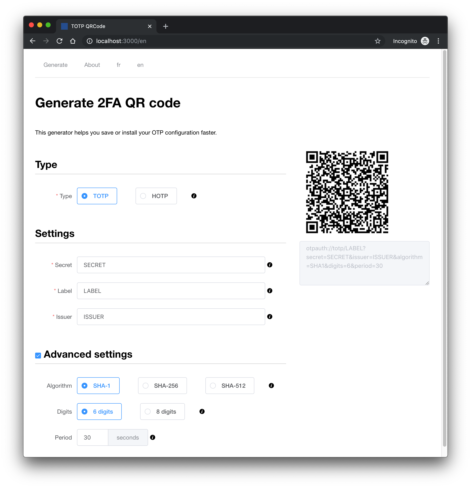

# otp-qrcode

> A simple service to quickly install your Google Authenticator compatible TOTP configuration from a QRCode.

## Information

[Information about this project](./src/content/en/about.md) in a different Markdown file.



## Todo

- SEO
- Encrypt + URL
- Copy generated URL
- Decrypt from URL

## Development

```bash
# install dependencies
npm run install

# serve with hot reload at localhost:3000
npm run dev

# build for production and launch server
npm run build
npm run start

# generate static project
npm run generate
```
